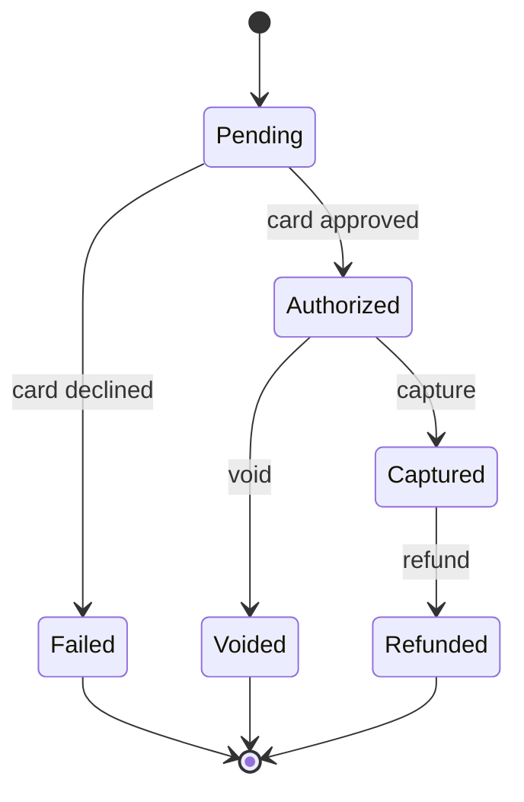

# Payment Gateway API


**Live demo:** [payment-gateway-zxyk.onrender.com/scalar](https://payment-gateway-zxyk.onrender.com/scalar) — interactive API docs (free tier; the first request may take ~50s to wake the instance).

A backend **payment gateway simulation** built with .NET, modeled after providers like Stripe and iyzico. It implements the *core logic* of a payment service provider — payment lifecycle, idempotency, signed webhooks, rate limiting, and a double-entry ledger — as a portfolio project focused on clean, testable, enterprise-style backend design.

> ⚠️ **Scope:** This is a learning/portfolio project. It uses **standard test card numbers only** and never processes real card data (no PCI-DSS scope). The goal is to demonstrate payment-system *logic and patterns*, not to be a production gateway.

---

## Features

- **API key authentication** — merchants authenticate via `Authorization: Bearer sk_test_...` (custom middleware).
- **Rate limiting (Redis)** — per-merchant fixed-window limit enforced in middleware using Redis atomic `INCR` + TTL; requests over the limit get `429 Too Many Requests`.
- **Payment lifecycle as a finite state machine** — `Pending → Authorized → Captured → Refunded`, plus `Authorized → Voided` and `Pending → Failed`. Invalid transitions are rejected with `409 Conflict`.
- **Request validation** — data-annotation validation on incoming DTOs (amount, currency, card format); errors are returned in the unified `ApiResponse` envelope.
- **Card validation** — Luhn algorithm + test-card rules.
- **Idempotency** — an `Idempotency-Key` header prevents duplicate charges; the first response is stored and replayed for repeated requests.
- **Signed webhooks** — payment status changes are delivered to the merchant's URL via a background service, signed with **HMAC-SHA256**, with **retry + exponential backoff** on failure (outbox pattern).
- **Double-entry ledger** — capture/refund post balanced, append-only ledger entries (each transaction sums to zero); merchant balances are *derived* from the ledger, not stored, plus a daily settlement report.
- **Layered architecture** — Controller / Service / DTO / Data separation, `ServiceResult<T>` ↔ `ApiResponse<T>` pattern, automatic audit fields, merchant data isolation.
- **Unit tests** — xUnit with EF Core InMemory (Luhn, state-machine guards, idempotency, ledger balance & zero-sum invariant).

## Tech Stack

.NET 10 · ASP.NET Core Web API · Entity Framework Core · PostgreSQL · Redis (StackExchange.Redis) · xUnit · Scalar (OpenAPI UI) · Docker / OrbStack

---

## Payment State Machine



`Failed`, `Voided`, and `Refunded` are terminal states.

## Double-Entry Ledger

Money movements are recorded in an append-only, double-entry ledger — the same principle banks and providers like Stripe use.

- Every real money event posts **two balanced entries** under one transaction: a **capture** credits the merchant's balance (`+amount`) and debits a clearing account (`−amount`); a **refund** posts the reverse. Each transaction **always sums to zero** — money is never created or destroyed.
- Ledger entries are **immutable** (never updated or deleted); a correction is a new reversing entry, preserving a full audit trail.
- A merchant's **balance is derived** as the sum of its ledger entries — never stored as a mutable field — so it can't drift out of sync.
- Only `Captured` and `Refunded` post to the ledger (real money moved); `Authorized`/`Voided` do not (funds only held/released).

## API Endpoints

All endpoints are under `/v1` and require `Authorization: Bearer <apiKey>`.

| Method | Endpoint | Description |
|--------|----------|-------------|
| `POST` | `/v1/payments` | Create & authorize a payment (supports `Idempotency-Key`) |
| `GET` | `/v1/payments/{id}` | Get a payment (merchant-isolated) |
| `POST` | `/v1/payments/{id}/capture` | Capture an authorized payment |
| `POST` | `/v1/payments/{id}/void` | Void an authorized payment |
| `POST` | `/v1/payments/{id}/refund` | Refund a captured payment |
| `GET` | `/v1/merchants/me/balance` | Merchant balance per currency (derived from the ledger) |
| `GET` | `/v1/reports/settlement?date=YYYY-MM-DD` | Daily settlement report (captured / refunded / net), defaults to today |

### Test cards

| Card number | Result |
|-------------|--------|
| `4242 4242 4242 4242` | Authorized |
| `4000 0000 0000 0002` | Failed (declined) |
| invalid Luhn | `400 Bad Request` |

### Example request

```bash
curl -X POST http://localhost:5142/v1/payments \
  -H "Authorization: Bearer sk_test_123456789" \
  -H "Idempotency-Key: 550e8400-e29b-41d4-a716-446655440000" \
  -H "Content-Type: application/json" \
  -d '{ "amount": 100, "currency": "TRY", "cardNumber": "4242424242424242" }'
```

---

## Getting Started

### Option A — Run with Docker (recommended)

The only requirement is Docker (or [OrbStack](https://orbstack.dev)). One command builds the API image, starts PostgreSQL and Redis, applies migrations on startup, and runs everything together:

```bash
docker compose up --build
```

### Option B — Run locally (.NET SDK)

Requires the [.NET 10 SDK](https://dotnet.microsoft.com/download) plus Docker for PostgreSQL and Redis.

```bash
# 1. Start PostgreSQL
docker run --name paymentgateway-db \
  -e POSTGRES_PASSWORD=postgres \
  -e POSTGRES_DB=paymentgateway \
  -p 5432:5432 -d postgres:17

# 2. Start Redis
docker run --name paymentgateway-redis -p 6379:6379 -d redis:7

# 3. Apply migrations
dotnet ef database update --project src/PaymentGateway.Api

# 4. Run the API
dotnet run --project src/PaymentGateway.Api --launch-profile http
```

### Once it's running

- API: `http://localhost:5142`
- Interactive API docs (Scalar): `http://localhost:5142/scalar`
- Seeded test merchant API key: `sk_test_123456789`

### Run the tests

```bash
dotnet test
```

---

## Project Structure

```
payment-gateway/
├── src/PaymentGateway.Api/
│   ├── Controllers/      # HTTP endpoints
│   ├── Services/         # Business logic (payments, idempotency, webhooks, ledger)
│   ├── Middleware/       # API key auth + Redis rate limiting
│   ├── Models/           # Entities + enums (state machine)
│   ├── DTOs/             # Request/response contracts
│   ├── Data/             # EF Core DbContext
│   └── Common/           # ServiceResult, ApiResponse, Luhn, HMAC
└── tests/PaymentGateway.Api.Tests/   # xUnit tests
```

## Roadmap

- [x] Redis rate limiting (per-merchant, fixed window)
- [x] Double-entry ledger, balances & settlement reporting
- [ ] Redis idempotency cache (cache-aside over PostgreSQL)
- [ ] Message queue for webhook delivery (RabbitMQ)
